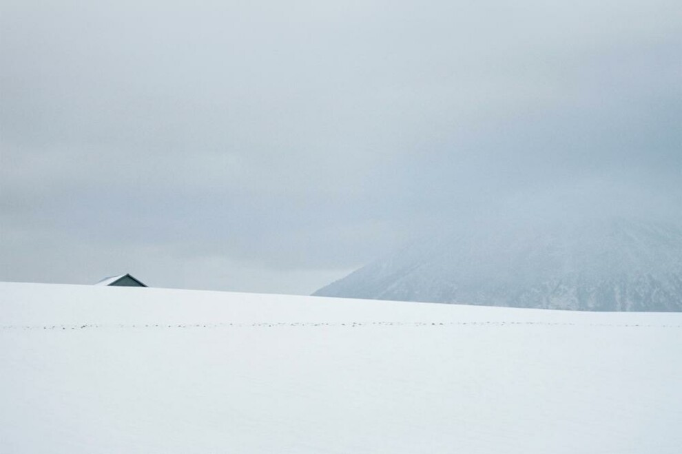
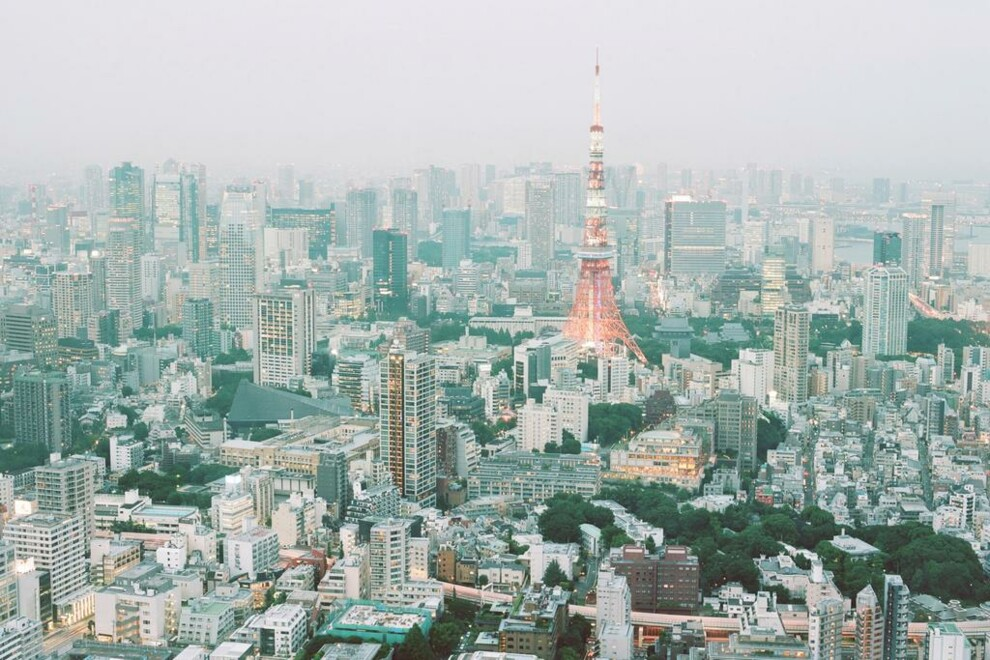
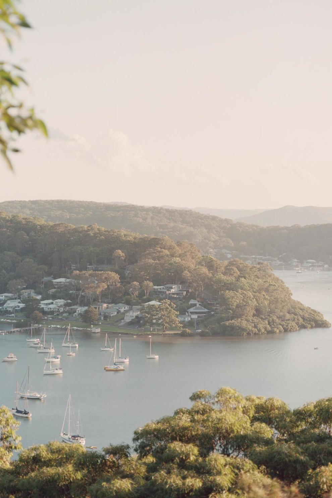
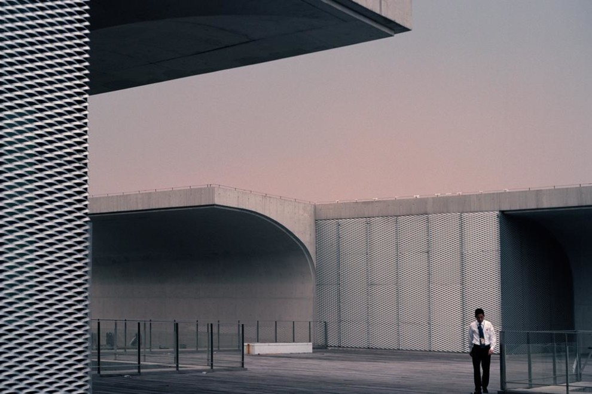

**Фотографировать как профи: советы тревел-фотографа Рори Гардинера**

Путешествие – это привилегия, которую нельзя воспринимать как должное. Мы привыкли упаковывать чемоданы и уезжать, чтобы словить настоящий момент на фоне красивых достопримечательностей или наоборот упустить его, непрерывно щелкая затвором. Фотограф Рори Гардинер поделился советами создания идеальных кадров и рассказал о местах, которые стоит посетить, когда будет можно.

**Выберите подходящее время**

“Старайтесь снимать в начале или в конце дня”, – советует Гардинер, добавляя, что “в это время свет более интересный, предлагает разные тени и широкий диапазон цветов”. Что касается путешествий, Гардинер рекомендует Японию тем, кто любит приключения в шумном городе вместе с тихим спокойствием островной жизни.

“Очевидно, что я одержим фотографированием огромных пульсирующих мегаполисов, и Токио – вершина этого”, – говорит Гардинер. “Вместе со смотровыми площадками и легкодоступными обзорными пунктами можно неделями фотографировать город сверху”, –продолжает он. Фотограф рекомендует выяснить, в каких отелях есть общественные бары на крышах, чтобы иметь возможность полюбоваться просторными видами на город сверху.

“На самом северном острове Японии Хоккайдо выпадает до 16 метров снега в год. Всю зиму остров покрыт чистейшим белым снегом, что позволяет снимать минималистичные пейзажи везде, куда бы вы ни пошли”, – рассказывает фотограф.

**Не зацикливайтесь на оборудовании**

“Лучшая камера та, которая у вас есть, – заявляет Гардинер. – Наличие специального оборудования не очень помогает, если его нет с собой в нужное время. Не бойтесь использовать свой телефон или компактную камеру, в наши дни они могут предложить потрясающие результаты!” Путешествуя локально, выбирайте места с просторными пейзажами, чтобы практиковать пейзажную съемку в естественном освещении.

**Камера не всегда видит то же, что и вы**

“Если вы снимаете здание или городской пейзаж, постарайтесь сделать это ровно! Здания кажутся нам прямыми, когда мы смотрим на них, поэтому убедитесь лишний раз, что камера “видит” их так же!” - предупреждает Гардинер. Совет профессионала особенно полезен, если вы собрались в кругосветное путешествие, прикрепив камеру на бампер автомобиля. Ведь в старых районах Амстердама или Лондона здания часто стоят под наклоном.

Гардинер советует добавить Kandalama Hotel на Шри-Ланке в список обязательных для посещения мест, если вам нравится исследовать места, где искусственная среда встречается с природой. 

“Это длинное сооружение авторства Джеффри Бавы построено на склоне горы и полностью покрыто густой растительностью, что позволяет создавать кадры, на которых стирается граница между архитектурой и природой”, – объясняет Гардинер.
